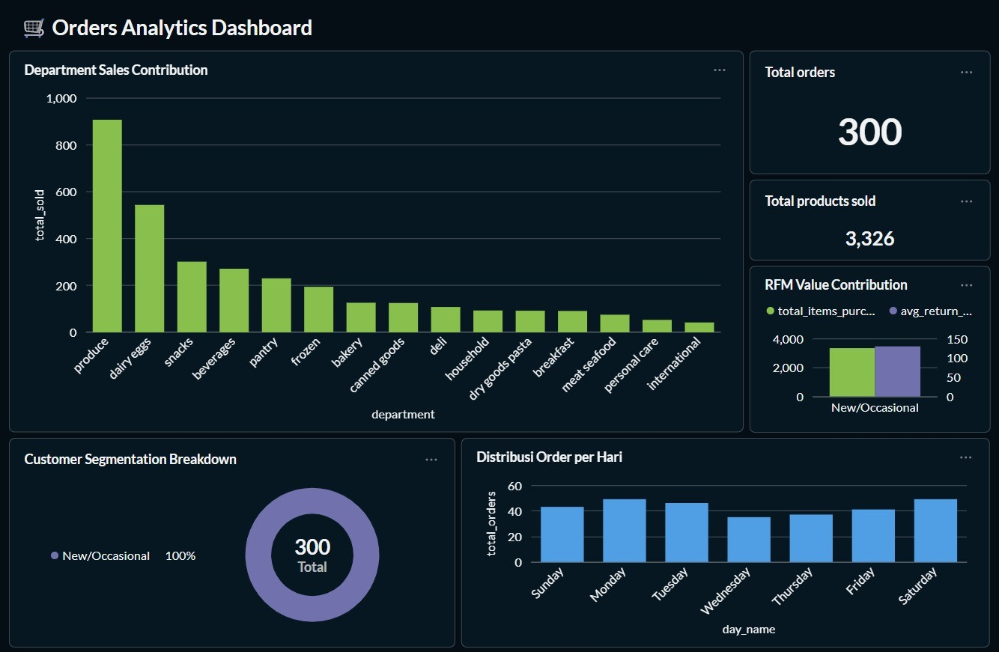
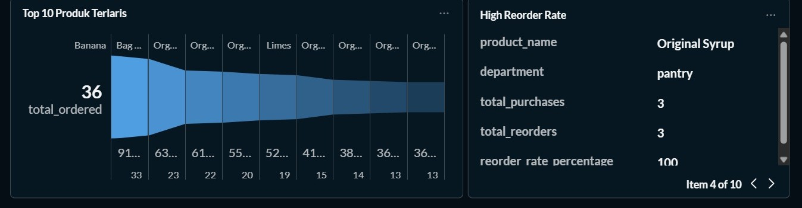
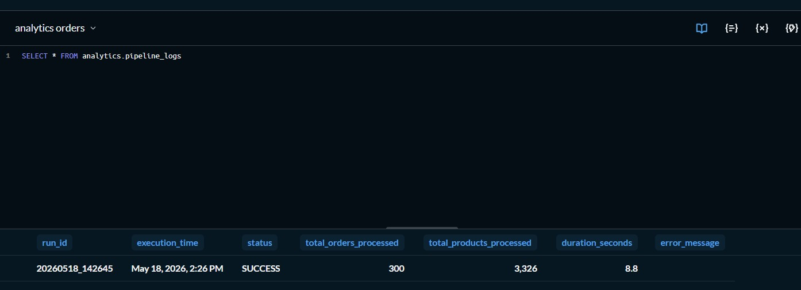

# Data Pipeline: API to ClickHouse

*MCI Lab - Task 2 (Orchestration)*

## Anggota Kelompok:
| Nama | NRP | Kontribusi (%)|
| --- | --- | --- |
| Muhammad Abid Baihaqi Al Faridzi | 5025241133 | 50% |
| Dilbina Windi Azahra | 5025241180 | 50% |

--- 

## Overview

Proyek ini membangun sebuah *data pipeline* yang mengambil data dari API eksternal, memprosesnya, dan menyimpannya ke dalam ClickHouse. Kemudian, diorkestrasi menggunakan Apache Airflow dan divisualisasikan dengan Metabase.

---

## Arsitektur & Alur Data

1. **Extract (Ingestion):** Skrip `fetch_orders.py` menarik data JSON dari API Orders eksternal, melakukan *flattening* pada struktur data (Orders & Products), lalu menyimpannya ke dalam *Data Lake* lokal sebagai file `.parquet` yang terkompresi.
2. **Transform (PySpark):** Skrip `process_orders_spark.py` membaca aliran file Parquet tersebut dan menangani nilai yang hilang (*missing values*). Skrip ini menghitung metrik **RFM (Recency, Frequency, Monetary)** untuk mengelompokkan pelanggan ke dalam segmen (Loyal, Regular, New/Occasional).
3. **Load (ClickHouse):** Data mentah yang telah diperkaya beserta *Data Mart* agregasi dimuat ke dalam ClickHouse menggunakan engine **`MergeTree`** untuk mendukung optimasi kueri OLAP.
4. **Orchestration:** Seluruh alur kerja diotomatisasi dan dijadwalkan secara berkala menggunakan **Apache Airflow**.
5. **Observability:** Log eksekusi *pipeline*, durasi, status, serta *error* secara otomatis dicatat kembali ke dalam tabel khusus di ClickHouse (`pipeline_logs`) untuk memonitorkan kinerja pipeline.
6. **Visualization:** Metabase terhubung ke ClickHouse untuk menyajikan *dashboard* interaktif.

---

## Struktur Direktori Proyek

```text
orders-data-pipeline/
│
├── dags/
│   ├── orders_pipeline.py                 
│   └── scripts/
│       ├── fetch_orders.py         
│       └── process_orders_spark.py 
│
├── data_lake/
│   ├── orders/                     
│   └── products/                   
│
├── assets/
├── requirements.txt
├── metabase.sql
├── docker-compose.yml              
├── Dockerfile                      
└── README.md
```

- `assets`: Folder untuk menyimpan gambar dan diagram.
- `metabase.sql`: Skrip SQL yang digunakan untuk membuat dashboard di Metabase.
- `docker-compose.yml`: Konfigurasi Docker Compose untuk menjalankan Airflow, PostgreSQL, ClickHouse, dan Metabase.
- `Dockerfile`: Basis image Airflow + instalasi Java untuk mendukung Spark.
- `requirements.txt`: Dependensi Python yang dibutuhkan oleh Airflow dan skrip pipeline.
- `dags/orders_pipeline.py`: Definisi DAG Airflow yang mengatur urutan tugas pipeline.
- `dags/scripts/fetch_orders.py`: Skrip untuk menarik data dari API orders dan menyimpan hasilnya sebagai file Parquet di `data_lake`.
- `dags/scripts/process_orders_spark.py`: Skrip Spark untuk membaca data Parquet dari data lake, memproses data, dan menulis ke ClickHouse.
- `data_lake/orders/`: Folder penyimpanan file Parquet untuk data orders.
- `data_lake/products/`: Folder penyimpanan file Parquet untuk data produk yang terkait pesanan.

---

## Alur Kerja

1. `docker-compose up` menjalankan seluruh stack:
   - Airflow webserver dan scheduler
   - PostgreSQL sebagai metadata database Airflow
   - ClickHouse sebagai data warehouse analytic
   - Metabase untuk visualisasi

2. Airflow membaca DAG `orders_pipeline` dari `dags/orders_pipeline.py`.

3. DAG `orders_pipeline` memiliki dua task utama:
   - `fetch_orders`: menjalankan `fetch_orders.py`.
   - `process_orders_spark`: menjalankan `process_orders_spark.py`.

4. Task `fetch_orders`:
   - Memanggil API `http://96.9.212.102:8000/orders` dengan parameter `table_name=orders`.
   - Mengambil respons JSON dan memisahkan data menjadi dua tabel:
     - `orders`
     - `products`
   - Menyimpan hasil sebagai file Parquet ke:
     - `/opt/airflow/data_lake/orders/orders_<timestamp>.parquet`
     - `/opt/airflow/data_lake/products/products_<timestamp>.parquet`

5. Task `process_orders_spark`:
   - Memulai Spark session.
   - Membaca semua file Parquet di folder `data_lake/orders` dan `data_lake/products`.
   - Memilih kolom yang penting dan membersihkan nilai kosong.
   - Mengumpulkan baris Spark menjadi list tuple.
   - Membuat koneksi ClickHouse ke host `clickhouse-server` dengan user `admin` dan password `rahasia`.
   - Membuat database `analytics` jika belum ada.
   - Membuat tabel `analytics.orders` dan `analytics.orders_products` jika belum ada.
   - Mengosongkan tabel ClickHouse, lalu melakukan insert ulang data dari Parquet.
   - Menghapus file Parquet yang sudah diproses agar data lake tetap bersih.

---

## Tujuan Setiap File

### `docker-compose.yml`
- Menyediakan lingkungan terisolasi dengan Airflow, PostgreSQL, ClickHouse, dan Metabase.
- Airflow menggunakan `LocalExecutor`.
- `airflow-init` menyiapkan database dan membuat user admin Airflow.
- ClickHouse dan Metabase tersedia untuk analitik dan visualisasi.

### `Dockerfile`
- Menggunakan image resmi `apache/airflow:2.9.1-python3.11`.
- Menambahkan Java runtime karena `pyspark` membutuhkan Java.
- Meng-copy `requirements.txt` dan meng-install dependensi Python.

### `requirements.txt`
- `pyspark`: untuk pemrosesan data Spark.
- `clickhouse-driver`: untuk menulis hasil ke ClickHouse.
- `pandas`: untuk memproses JSON API dan menyimpan Parquet.
- `requests`: untuk mengambil data dari API.
- `pyarrow`: backend Parquet untuk Pandas.

### `dags/orders_pipeline.py`
- DAG Airflow dengan dua tugas.
- `schedule_interval='@once'` berarti pipeline dijalankan satu kali secara manual atau ketika docker-compose dijalankan.
- Menjamin eksekusi `fetch_orders` dulu, lalu `process_orders_spark`.

### `dags/scripts/fetch_orders.py`
- Menarik data sumber dari API orders.
- Melakukan flatten terhadap informasi pesanan dan produk.
- Menyimpan hasil sebagai Parquet di data lake lokal.

### `dags/scripts/process_orders_spark.py`
- Membaca data Parquet dengan Spark.
- Melakukan transformasi kolom dan membersihkan nilai kosong.
- Melakukan aggregasi untuk menghitung metrik RFM.
- Membuat logging pipeline ke ClickHouse untuk observability.
- Menyinkronkan data ke ClickHouse dengan model tabel analytics.
- Menghapus file Parquet usang setelah dimuat.

---

## Catatan Tambahan

- Path hardcoded di Airflow task menggunakan `/opt/airflow/dags/scripts/...` karena container mapping volume ke folder lokal.
- ClickHouse diakses pada `clickhouse-server` sesuai service name Docker Compose.
- Proses ini menggunakan pendekatan `truncate & insert` agar tabel analitik selalu fresh.
- Jika ingin menjalankan ulang pipeline, pastikan `docker-compose up --build` dijalankan dan DAG Airflow dieksekusi dari UI atau trigger manual.

---

## Cara Jalankan

1. Dari root proyek, jalankan:
   ```bash
   docker-compose up --build
   ```

2. Buka Airflow UI di `http://localhost:8080`.
3. Aktifkan dan jalankan DAG `orders_pipeline`.
4. Gunakan ClickHouse client atau Metabase untuk memeriksa data di database `analytics`.

---

## Visualisasi Dashboard




### Analisis Dashboard

1. Department Sales Contribution

   Visualisasi ini menampilkan kontribusi jumlah produk terjual berdasarkan department.

   **Key Insight:**

   - Department `produce` menjadi kontributor terbesar. 
   - Mayoritas customer melakukan pembelian kebutuhan sehari-hari (daily essentials dan groceries).

2. Total Orders KPI

   Menampilkan total order yang diproses oleh pipeline.

   **Key Insight:**

   - Total order yang berhasil diproses adalah **300** order.

3. Total Products Sold KPI

   Menampilkan total item yang berhasil terjual.

   **Key Insight:**

   - Total produk yang terjual mencapai **3326** item.
   - Jumlah produk yang terjual jauh lebih besar dibanding jumlah transaksi order.

4. RFM Value Contribution & Customer Segmentation Breakdown

   Visualisasi ini menunjukkan kontribusi customer berdasarkan RFM segmentation dan distribusi segmentasi customer.

   **RFM Components:**

   - Recency → rata-rata jarak hari antar order
   - Frequency → jumlah transaksi
   - Monetary → total volume item yang dibeli

   **Key Insight:**

   Semua customer masih berada pada segment:
   - `New/Occasional`
   - Dataset masih didominasi customer dengan aktivitas transaksi rendah.

5. Distribusi Order per Hari

   Visualisasi ini menunjukkan distribusi jumlah transaksi berdasarkan hari.

   **Key Insight:**

   Aktivitas order tertinggi terjadi pada:
   - Saturday
   - Monday
   - Tuesday

   Hal ini menunjukkan bahwa pelanggan cenderung melakukan pembelian pada awal minggu dan akhir pekan.

6. Top 10 Product Terlaris

   Visualisasi ini menunjukkan produk dengan total order tertinggi.

   **Key Insight:**

   Produk terlaris adalah:
   - Banana
   - Bag of Organic Bananas
   - Organic Baby Spinach
   - Organic Strawberries
   - Organic Hass Avocado
   - Limes
   - Organic Whole Milk
   - Organic Lemon
   - Organic Cucumber
   - Organic Garlic

   Hal ini menunjukkan bahwa produk organik dan kebutuhan sehari-hari mendominasi penjualan.

7. High Reorder Rate Products

   Tabel ini menunjukkan produk dengan tingkat reorder tertinggi.

   **Key Insight:**

   - Produk dengan reorder rate tinggi menunjukkan adanya kebutuhan berulang.

---

# Logging Pipeline

